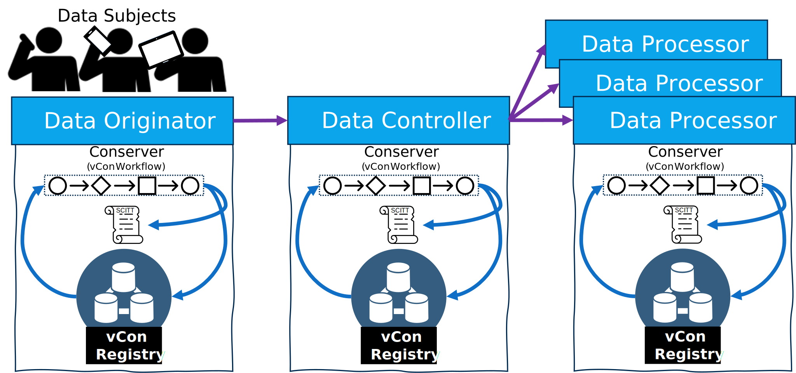

# vCon Lifecycle Events and Operations

[vCons][draft-vcon] are powerful means to capture and collaborate on the details of a Virtual Conversation, feeding AI systems, enabling entities to more accurately respond to customer needs, and entities to more effectively manage the health of their business.

vCons contain multiple elements of Personally Identifiable Information of the parties involved, including phone numbers, emails, voice & facial prints and location information.
These elements are what make vCons so powerful to assist customers.
However, the information must be handled responsibly, giving the involved parties an opportunity to consent to their information being captured, and the ability to revoke consent with the right to be forgotten.

Multiple regulations, including the US born [California Consumer Protection Act (CCPA)][CCPA] and the EU born [General Data Protection Regulation (GDPR)][GDPR] outline requirements for entities to responsibly use and dispose of PII information upon request.

This draft provides an overview of the requirements and a workflow to onboard customers with end-to-end, interoperable services and tooling.
The workflow enables entities in the workflow to be collaborate on a vCon, while assuring all entities in the workflow are adhering to relevant PII regulations using a [Supply Chain, Integrity, Transparency and Trust (SCITT)][draft-scitt] Ledger.

## Conventions and Definitions

The following terms, derived from [California Consumer Protection Act (CCPA)][CCPA], [General Data Protection Regulation (GDPR)][GDPR] and the [IETF: draft-james-privacy-primer-vcon][privacy-primer-vcon], are used throughout the document:

- **Conserver**: A vCon workflow engine that ingests vCons, routing them for processing and enhancements.
A conserver doesn’t store a vCon, rather it processes the vCon for transcription, sentiment, integrity protection on egress, verification on ingress, retrieving it from, and saving it to a vCon Registry.
- **Data Subject**: The individual(s) whose personal information is processed (also referred to as the “consumer” in many personal data privacy laws).
- **Data Originator**: The Entity that records and initiates the vCon, identifying the parties, including the media of the conversation.
For a phone call, this may include the phone numbers and the audio recording.
For internet-based calls, such as Microsoft Teams, Zoom, Google meet, this may include emails and audio/video recording.
The Data Originator is a facilitator with access to the content of the call.
The Data Originator is not typically responsible for gaining consent, as they are providing infrastructure.
One or all of the Data Subjects must initiate consent, giving the Data Originator the right to record the conversation, which may be the Data Controllers responsibility to identify.
- **Data Controller**: An Entity or individual with decision-making authority over data processing who determines the purposes and methods of data processing, bears primary responsibility under privacy laws and is the main target of most privacy and data protection regulations.
- **Data Processor**: Often a third-party service provider who processes data on behalf of the data controller.
Under [Health Insurance Portability and Accountability Act (HIPAA)][hippa], data processors are referred to as "business associates."
Data processors may be hired for specialized tasks or to improve efficiency; can subcontract to other processors, creating a chain of responsibility; must operate within the scope defined by the data controller; and are expected to maintain trust and adhere to the controller's guidelines.  
A Conserver often calls out to Data Processors for Transcription, Sentiment Analysis, Fraud Detection, email/text messaging.
- **Entity**: A generic reference to companies, groups or individuals that may share, alter, consume a vCon.
An entity may be a Data Originator, Data Controller, Data Processor or some other role that has not yet been defined that participates in the possession and/or processing of a vCon.
- **Party**: A party, or participant of a vCon, as identified in the vCon draft.
- **SCITT Transparency Service**: An append-only ledger for integrity protecting vCons, ensuring the state of a vCon is known at a point in time for conformance to governance and regulatory requirements.
- **vCon Registry**: A storage service, capable of storing vCons, including rich metadata and larger attachments including audio and video recordings.

## vCon Lifecycle Events

The following events, or recorded operations, outline important “moments that matter” for the lifecycle events of a vCon.

A few operations overlap, for instance a vCon could be initially created (`vcon_created`), or it may be received as it passes across network boundaries, enabling a Data Controller or Data Processor to record the state of the vCon when they received it.
Other overlapping operations include a vCon that was redacted and deleted, or a vCon that may have expired and then was deleted.

The following events are not intended to be stored within the vCon, rather operations that are stored on [SCITT][draft-scitt], to provide context to the intent of the vCon at that point in time.

- `vcon_created:` The initial vCon document as it was first recorded.
The vCon may start with a basic structure to define the minimal metadata, as the recording or other attachments may be added asynchronously as their encodings are completed.
The minimal elements are defined within the [vCon draft][draft-vcon].
- `vcon_enhanced:` The vCon has had some element amended or appended.
While a vCon is considered immutable, information may be amended or appended.
Meaning, the previous values exist within a vCon Registry, but may be superseded with newer values.
Amended or appended values may include a transcription correction, or the changing of consent.
The `vcon_amended` operation should be used when no other specific amended/append operation is available.
- `vcon_sent:` The vCon was sent to an external party.
This operation seals the integrity of the vCon, ensuring what was sent, to whom and when is recorded on the SCITT Transparency Service..
When a vCon is sent, a SCITT receipt from the receiving vCon service assures possession was confirmed and recorded.
- `vcon_received:` Indicates the vCon was received from an external entity.
This indicates the Entity has taking possession at a given time, sealing the integrity of the content received, returning a SCITT receipt to the sending Entity.
A `vcon_received` compared to a `vcon_sent` must be identical as it proves the receiving party received the exact vCon that was sent from a sending party.
A vCon may be sent to multiple entities in many workflows that dispatch information for multiple Entities to followup on the lead.
To assure a chain of custody, knowing where a vCon was sent, the sending party must record who, when and how a vCon was sent with a receiving party returning a SCITT Receipt to prove the vCon was successfully transferred.
- `vcon_consent_accepted:` One or more of the parties have given consent to the vCon being recorded and shared for its intended purpose.
In many cases, consent may not be set in the initial creation of the vCon, as it’s the responsibility of the Data Controller to manage the consent of the Data Subjects.
A Data Originator provides infrastructure for the recording, and may not be responsible for tracking the consent of the parties.
As a result, a vCon may be created and sent across network boundaries and different Entities before the Data Controller has the opportunity to amend the vCon with who and how consent was given.
- `vcon_consent_revoked:` One or more parties have revoked their consent for one or more purposes.
Depending on the region, license and regulatory compliance associated with the vCon, one revocation of consent may, or may not require all Data Processors, to act upon the revocation.
The specific actions to be completed for the revocation of consent are deferred to the license and associated regulatory compliance.
The recording of `vcon_consent_revoked` is a trigger for all entities in possession of the vCon to be notified and act according to the associated license.
- `vcon_party_redacted:` A party to the vCon has been redacted.
This operation differs from consent revoked as a vCon may be viable of continuing if a party’s information can be redacted while maintaining the integrity and usefulness of the vCon.
For example, a party that "listens", but does not participate (communicate) in the conversation may be redacted from being represented as a listening participant.
Depending on the purpose of the vCon, the named party may need to be maintained, in redacted form, to legally acknowledge they may have heard a conversation, even if they didn't participate.
Note that redaction indicates the Data Controller may have history of the party’s participation, but is removed from any future sent copies of the vCon, and the redaction is sent to all consuming entities of the vCon.
A vCon that has been previously sent (vcon_sent) must communicate to all receiving entities of the vCon, that its state has changed, and they must act upon the `vcon_party_redacted` operation.
- `vcon_deleted:` The vCon has been deleted, as the outcome of an implicit act.
The vCon may be deleted due to revocation, or no longer needed by the Data Controller or Data Processors.
When a vCon is deleted, and no longer maintained by a Data Controller, the Data Controller must communicate with all receiving parties they must either delete the vCon, or become a Data Controller for the vCon going forward.
- `vcon_expired:` The vCon has expired, due to terms of its license or compliance.
An expired vCon must be communicated with any receivers of the vCon, and they must delete it.
An expired vCon is a trigger for why a vCon may be deleted, identifying no specific entity requested its deletion, rather the vCon has timed out for its intended use.
Identifying the future expiration date of a vCon is outside the scope of this operational identification.
This operation indicates the vCon has expired, forcing deletion and communication to shared entities.
- `vcon-rcvr-purged` When a vCon is sent from a Data Controller to another Entity, the vCon may be maintained indefinitely, for a designated period of time, or may be automatically deleted upon completion of the processed operation.  
When the vCon is sent for anything more than immediate deletion, the receiving Entity is assumed to have possession of the vCon and must be notified if/when the vCon's lifecycle has ended.
If the receiving Entity of a vCon no longer needs or wants to maintain possession and responsibility for lifecycle events, the Entity can delete the vCon and notify the sending Entity they no longer have a copy of the vCon, and no longer need to receive lifecycle notifications.
The receiving Entity will delete the vCon, record it on the SCITT ledger, and notify the sending Entity, getting a receipt they no longer need to receive notification events.

## Example vCon Lifecycle

The following are some examples for the lifecycle of a vCon, how it may be created, shared, consumed and updated across entities.

vCons have a lifecycle from creation with consent, processing, enhancements, to revocation and deletion.
The workflow involves a vCon moving across multiple companies and network boundaries, often fanning out in 1:many relationships of sharing.
An entity that creates or consumes vCons will have several components to their vCon services:

### vCon Create, Consent and Share

#### Data Originator

1. **Initiating Call**: An initiating caller contacts a Data Subject to provide a service.
1. **Consent to Record**: The initiating caller requests consent to record the call for training purposes.
    1. Does the full "purpose" of the call need to be confirmed at the beginning of the call, which may likely prompt the data subject to hang up?
    1. Can the initiating caller ask for consent to record for training purposes, then at the end, if the data subject appears to be interested, ask for the recording to be used for sales followup ("purpose-sales")?
    1. This would establish the call is being recorded, but reserved the "purpose" until the end of the call when it's known if the call is for "training" an "unsuccessful sales lead", or successful "sales" followup when the data subject has expressed interest?
    1. While the Data Originator performs the infrastructure for the initial creation of the vCon, they may not be accountable for recording the decision of consent for the data subject.  
    _**Note:** This does raise a question if a Data Originator can share a vCon with a Data Controller and Data Processor until consent is known.
Does a contractual relationship, providing infrastructure between the Data Originator, Data Controller and Data Processor(s) give a timeline by which consent can be confirmed, or the vCon must be deleted?_
1. **Consent to Share**: The call completes, confirming consent for the recording to be used for "sales followup", noting the data subject can review and revoke consent at a further date.
Using a well-known script to the Data Processor, the Data Subject is asked for where to send the consent confirmation message, providing more context to the initiating caller, and value to the Data Subject who know can confirm their consent was acknowledged.
1. **vCon Created**: The call completes, the vCon is created, recording the metadata of the call to the vCon Registry.
To create a baseline, the Data Originator may write to their SCITT Ledger the initial `vcon_created` operation, providing a means for other asynchronous operations to record additional integrity protected events.
1. **Recording Added**: The recording is saved to the vCon Registry, adding the recording to attachments section of the vCon.
1. **vCon Sent**: The Data Originator has completed their responsibilities and sent the vCon to the Data Controller.
As the vCon is traversing an entity and network boundary, the vCon is integrity protected by writing to a SCITT Transparency Service with a `vcon_sent` operation.
Within the SCITT meta-map, the identity for which the vCon was sent is recorded, providing a historical record.
The SCITT Receipt is attached to the vCon as it's sent to the Data Controller.

#### Data Controller

1. **vCon Received**: The vCon is received from the Data Originator, recording a `vcon_received` operation, in the SCITT Transparency Service.
The Data Controller can attest to the integrity of what was received, with the ability to verify the receipt that has been sent and stored in their vCon Registry.  
_Note: All relevant information of the vCon is copied to the Data Controllers vCon Registry, eliminating any dependencies on the Data Originator._
1. **vCon Enhanced with the License and Data Controller**: The Data Controller adds a transcription, the intended license and sets themselves as the Data Controller on the vCon.
Adding the license and identifying the Data Controller provides irrefutable knowledge to downstream consumers the license requirements and who is the legal Data Controller for this vCon.
1. **vCon Sent**: The Data Controller has sent the vCon to the Data Processor(s).
Similar to the Data Originator, the Data Processor integrity protects the vCon, and records who the vCon is sent to on the SCITT Transparency Service with a `vcon_sent` operation.
The SCITT Receipt is attached to the vCon as it's sent to each Data Processor.
The Data Controller records on their SCITT Transparency Service a SCITT Receipt from each Data Processor, confirming each Data Processor received the vCon, with the License and whom to contact for Data Processor requirements.

#### Data Processor(s)

1. **vCon Received**: The Data Processor validating the vCon SCITT receipt of from the Data Controller, and if proven to be from an Entity they trust, the Data Processor saves the vCon to their vCon Registry and records the inbound vCon to its SCITT Transparency service.
The transaction completes when the SCITT receipt is returned to the Data Controller, acknowledging they have received the vCon.
1. **Consent Recorded**: The Data Processor initiated the consent request, and knows what words to parse from the transcription, or knows the timestamp of the recording by which to highlight the consent given by the Data Subject.
An entry is made to the SCITT Transparency Service, adding `vcon_consent_accepted`, with the relative metadata in the SCITT metamap for how and where consent was confirmed.
1. **vCon Enhanced**: Sentiment and other vCon enhancements are processed through the Data Processors Conserver workflows.
1. **Consent Receipt Sent**: The Data Processor has the additional context to use AI, retrieving the contact information from the consent block of the transcribed conversation.
A notification (sms, email, ...) is sent to the Data Subject(s), with a link to review the consent, purpose and license associated with the vCon.
The Data Processor records to SCITT, with a `vcon_consent_sent` operation, attesting that consent was sent, the purpose, when and how the Data Subject(s) were contacted.
1. **Consent Review**: The Data Subject(s) has the option, at any time, to review the (TBD) information within the vCon, with the ability to revoke consent.
It may be beneficial to record if/when the Data Subjects review the consent as a `vcon_consent_reviewed` operation, but may not be mandatory.
1. **Data Processor Value-Add**: The Data Processor performs the value added services for the Data Subject(s), which may continue for whatever length of time is allowed within the License associated with the vCon, or until the consent for purpose expires, which is also specified in the vCon License.

### Revocation and the Right to Be Forgotten

At any point, a Data Subject can request revocation, and/or the right to be forgotten, requiring all possessors of the vCon to act on the Data Subjects wishes.
A vCon must be tracked for where it was sent, and who to contact when a Data Subject makes their request.
The SCITT Transparency Service maintains the metadata for the state of an ingested vCon, assuring the intent of the parties are integrity and inclusion protected.

#### Data Subject

1. **Revoke Consent**: At some point, the Data Processor may either complete their value added service, ending the consent for purpose, or the Data Subject(s) can choose to revoke consent for the specific purpose.

    In this scenario, the Data Subject clicks the link, contained in all communications between the Data Processor and the Data Subject(s).
The link may be hosted by the Data Processor or the Data Controller.
The Data Subject(s) choose to revoke consent, related to this vCon.
The intent is recorded on the SCITT Ledger with a `vcon_consent_revoked` operation.

1. **Revoke Request Sent**: If the `vcon_consent_revoked` operation was handled by the Data Processor, they MUST contact the Data Controller, communicating the intent of Data Subject.
The Data Processor records `vcon_consent_revoked_request` to their SCITT instance, recording the date, time and an identifier for the Data Subject that made the request, and when they contacted the Data Controller.
The Data Processor records the SCITT Receipt, proving the Data Processor acknowledged receipt of the request.

#### Data Controller Revocation

1. **Act on Consent Revocation Request**: The Data Controller receives the vCon Consent Revocation Request, recording the request on their SCITT Transparency Service.
Depending on the License and regional requirements for one or multi-party consent, the vCon may be deleted or the Data Subject may be redacted from the vCon.
1. **Send Revocation Request with Data Controllers**: If the vCon was sent to other data processors, or if the request to revoke consent came direct to the Data Processor, they must send the revocation request (right to be forgotten) with any Data Processor that has not yet acknowledged the request.
For each Data Processor, the Data Controller records the vCon ID, the Data Processor and when the request was made of the Data Processors.
Each Data Processor must comply with the request within the time period specified in the License associated with the vCon license attribute.

#### Data Processor Revocation

1. **Deletion of Data**: Closing the loop, any Data Processor that had not yet acted on behalf of the request must acknowledge the request.
Each Data Processor will record on their SCITT Ledger the vCon and when they acknowledged the request to be forgotten.

#### Acts of Trust and Transparency

Throughout the workflow, no one entity can prove the other entities in the lifecycle of the vCon performed the actions they were required to do.
However, the entities sharing the vCons and the intent of the Data Subjects can be proven what and when the vCon and the intent was communicated by auditing the SCITT Ledgers of the parties involved.

Through this process, each Entity can prove they acted on the acknowledged consent and intent of the Data Subject, holding the other Entities accountable to performing their required operations.

## Standards Based Interoperability

The breadth of industries and scenarios that can benefit from virtual conversations spans vast numbers of companies.
The power in the technology is the ability to collaborate across conversations.
By implementing a standards-based approach, collaborative and competitive companies can easily integrate with solutions from transcription, consent management, CRM integration.

By packaging the conversation and the associated metadata within a vCon format, the parties have a means to communicate what has been sent.

Due to the personally identifiable information and digital fingerprinting of vCons, it’s just as important to understand and adhere to regulatory requirements for how PII information should be managed.
Defining and implementing a standard provides stability for how to manage the information and its lifecycle.

Recording what elements of the vCon were sent to various parties holding each party accountable for what was sent, what was received and when it occurred.

### Data Subject Visibility

**TODO:** What visibility and access does a Data Subject have?

- Can they be sent a link to their vCons?
- What can they see or listen to?
- Can they, should they be able to see all the places their vCon has been sent to?
  1. Is that too scary, and too much visibility into the sausage factory?
  1. Can they set the consent for purpose, or change the purpose?
  1. Can they revoke, and see the status of revocation (50% of all sharing has been completed)
  1. If someone has received a copy, but hasn’t acknowledged it, should the Data Subject be told which company that is?

## What Differentiates SCITT from a Database

The information written to SCITT could be compared to information written in a standard database.
So, what makes SCITT different?

To be elaborated upon:

- Immutable and Append Only nature
- Cryptographically secure as statements are pre-signed, making SCITT a notary of previously signed statements, assuring the SCITT service can’t alter the contents as it’s written
- Independently verifiable
- Separation of the immutable, append only ledger, the evidentiary metadata store which can be deleted and/or redacted for PII governance requirements
- The standards by which to communicate and enforce regulations and compliance

## Q & A

- What makes SCITT different from an immutable database?
- What makes SCITT different from Blockchain Technology?
- Are different ledger formats supported?
  - Yes – Datatrails implements a Merkle Mountain Range implementation, providing performance, scale and the ability to purge older information reducing storage, while maintaining the overall integrity protection.
Other implementations like Microsoft CCF or RFC 9162 provide alternative formats.

## Appendix

### Cloud and OnPrem services

While each entity of a workflow will want and need to manage their own instances of the vCon Services, the services are likely cloud-hosted SaaS, assuring the entity maintains their core business focus.

### Open Items

#### vCon Manifests

vCons represent several elements, which contain rich privacy information, or large formats.
For reasons of privacy, conformance to governance, or cost efficiency of storage, vCon elements may be individually stored as blobs.
A vCon Manifest references the blobs, enabling the sharing of a subset of a vCon, while still integrity protecting the contents.

[CCPA]:                 https://oag.ca.gov/privacy/ccpa
[draft-vcon]:           https://datatracker.ietf.org/wg/vcon/about
[draft-scitt]:          https://datatracker.ietf.org/wg/scitt/about
[GDPR]:                 https://gdpr.eu/
[hippa]:                https://www.hhs.gov/hipaa/index.html
[privacy-primer-vcon]:  https://datatracker.ietf.org/doc/draft-james-privacy-primer-vcon/
